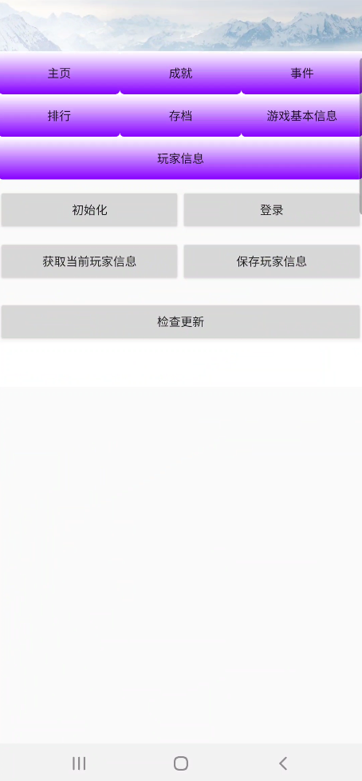

# Game Service Kit

## Table of Contents

 * [Introduction](#introduction)
 * [Getting Started](#getting-started)
 * [Supported Environments](#supported-environments)
 * [Result](#result)
 * [License](#license)

## Introduction
   GameServiceKit Android sample code encapsulates APIs of the HUAWEI GameSevice Kit. It provides many sample programs for your reference or usage.
The following describes packages of Android sample code.

   achievement:    Sample code of achievement feature.
   archive:        Sample code of archive feature.
   event:          Sample code of event feature.
   gamematadata:   Sample code of game matadata feature.
   playerstats:    Sample code of playerstats feature.
   ranking:        Sample code of ranking feature.
   common:         Common components and utils

## Getting Started

   1. Check whether the Android studio development environment is ready. Open the sample code project directory with file "build.gradle" in Android Studio. Run TestApp on your divice or simulator which have installed latest Huawei Mobile Service(HMS).
   2. Register a [HUAWEI account](https://developer.huawei.com/consumer/en/).
   3. Create an app and configure the app information in AppGallery Connect.
   See details: [HUAWEI Game Service Development Preparation](https://developer.huawei.com/consumer/en/doc/development/HMSCore-Guides-V5/config-agc-0000001050166285-V5)
   4. To build this demo, please first import the demo in the Android Studio (3.x+).
   5. Configure the sample code:
   (1) Download the file "agconnect-services.json" of the app on AGC, and add the file to the app root directory(\app) of the demo.
   (2) Change the value of applicationid in the app-level build.gradle file of the sample project to the package name of your app.
   6. Run the sample on your Android device or emulator.

## Supported Environments
   Android SDK Version >= 23 and JDK version >= 1.8 is recommended.

## Result
   

## Question or issues
If you have questions about how to use HMS samples, try the following options:
- [Stack Overflow](https://stackoverflow.com/questions/tagged/huawei-mobile-services) is the best place for any programming questions. Be sure to tag your question with 
**huawei-mobile-services**.
- [Huawei Developer Forum](https://forums.developer.huawei.com/forumPortal/en/home?fid=0101187876626530001) HMS Core Module is great for general questions, or seeking recommendations and opinions.

If you run into a bug in our samples, please submit an [issue](https://github.com/HMS-Core/hms-game-demo/issues) to the Repository. Even better you can submit a [Pull Request](https://github.com/HMS-Core/hms-game-demo/pulls) with a fix.

##  License
   GameSeviceKit sample is licensed under the: [Apache License, version 2.0](http://www.apache.org/licenses/LICENSE-2.0).
